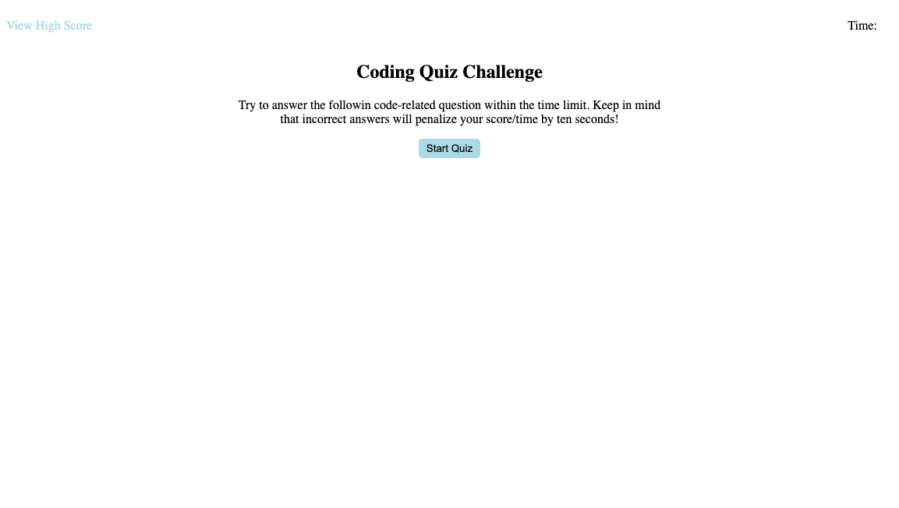

# Web-APIs-timed-quiz

## Description
    This is a simple front end development themed quiz. The test is timer based and due to productivity its only 30 seconds long. The application will notify the user if the answered questions are correct, if not the user will have 5 seconds deducted from the timer. When the timer is finished the points will be calculated and saved to local storage. The score page keeps track of all the scores.

## Built with
    * HTML
    * CSS
    * JavaScript
    * Web API's

## Website Link
    https://itzamary.github.io/Web-APIs-timed-quiz/
## image
